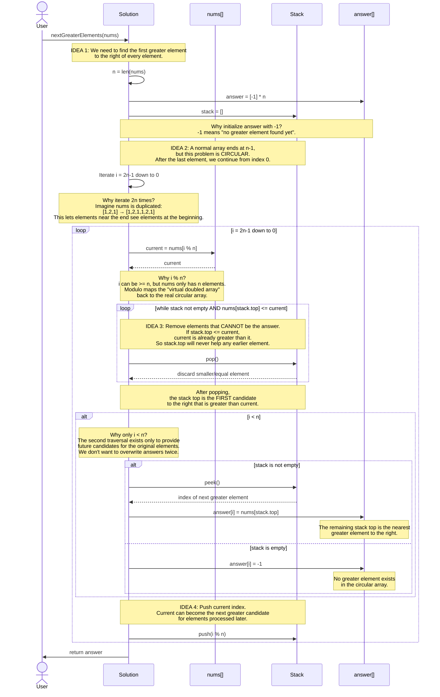

Here is solutions for Sequence Diagram and Pseudocode - Next Greater Element II.

# 1. Sequence Diagram



# 2. Pseudocode

```python
FUNCTION nextGreaterElements(nums):

    n = length(nums)

    // IDEA 1:
    // Initially assume every element has no greater element.
    answer = array of size n filled with -1

    // Stack stores indices of elements that can still
    // become the "next greater element" for something.
    stack = empty stack


    // IDEA 2:
    // The array is circular.
    // Instead of physically duplicating nums,
    // simulate [nums + nums] by using i % n.
    //
    // Example:
    // nums = [1, 2, 1]
    // virtual = [1, 2, 1, 1, 2, 1]
    //
    // We go from right → left because when processing
    // an element, we want to already know about elements
    // to its right.
    FOR i = 2*n - 1 DOWN TO 0:

        current = nums[i % n]


        // IDEA 3:
        // Remove elements that cannot be the next greater
        // element for the current element.
        //
        // If stack.top <= current:
        //     current is already greater than stack.top.
        //
        // Therefore stack.top will never be useful as
        // a greater element for the current or earlier elements.
        WHILE stack is not empty
              AND nums[stack.top] <= current:

            stack.pop()


        // After removing smaller/equal elements:
        //
        //     stack.top
        //
        // is the nearest element to the right that is
        // greater than current, if one exists.

        IF i < n:

            IF stack is not empty:

                answer[i] = nums[stack.top]

            ELSE:

                answer[i] = -1


        // IDEA 4:
        // Current element can become a candidate for
        // elements that will be processed later.
        //
        // Store its real circular index, not i,
        // because nums only has indices [0 ... n-1].
        stack.push(i % n)


    RETURN answer
```

# 3. Implementation Python

```python
def next_greater_elements(nums):
    n = len(nums)

    # IDEA 1:
    # Initially assume every element has no greater element.
    answer = [-1] * n

    # Stack stores indices of useful candidates.
    stack = []

    # IDEA 2:
    # Simulate a circular array by traversing 2n elements.
    #
    # Instead of creating:
    # [nums + nums]
    #
    # use nums[i % n].
    for i in range(2 * n - 1, -1, -1):

        current = nums[i % n]

        # IDEA 3:
        # Remove elements that cannot be the next greater element.
        #
        # If stack.top <= current, current is already
        # greater than stack.top, so stack.top is useless.
        while stack and nums[stack[-1]] <= current:
            stack.pop()

        # Only fill the answer for the original n elements.
        #
        # The second traversal (i >= n) is only used to
        # provide candidates for the circular part.
        if i < n:

            if stack:
                answer[i] = nums[stack[-1]]
            else:
                answer[i] = -1

        # IDEA 4:
        # Current element can become a candidate for
        # elements processed later.
        stack.append(i % n)

    return answer
```
