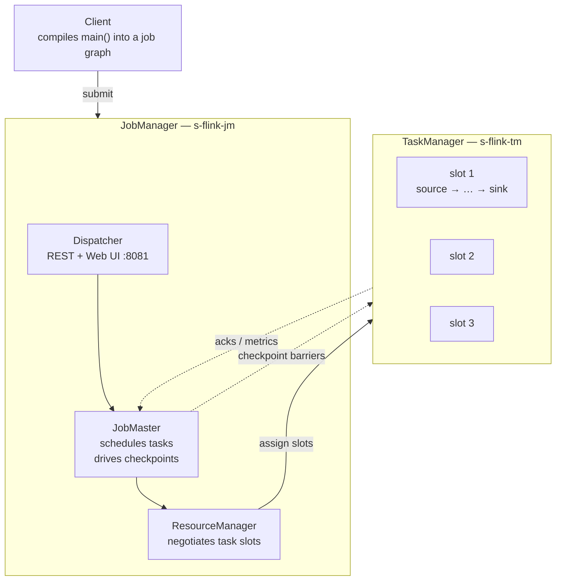

Apache Flink is a **distributed stream processing framework** designed for **high-throughput**, **low-latency**, and **stateful** data processing.

## 1. Overview

Flink treats **streaming as the primary execution model**.

---

# 2. Why Flink?

Traditional systems process data in batches.

```text
       ┌─────────────────────── Flink job (a dataflow DAG) ───────────────────────┐
 Kafka ─┤  Source → map/filter → keyBy → window/process (STATE + TIMERS) → Sink    ├─► Redis
        └───────────────────────────────────────────────────────────────────────────┘
                     every operator is parallelized into subtasks
```

This introduces latency because processing only begins after enough data has accumulated.

Flink processes each event as soon as it arrives.

This enables applications that require real-time responses.

Examples:

- Fraud detection
- Ride matching (Grab, Uber)
- Recommendation systems
- Monitoring dashboards
- IoT analytics
- Financial trading

---

## 3. Cluster anatomy

A running Flink cluster has three roles:

| Role | What it does |
|---|---|
| **Client** | Compiles your `main()` into a dataflow graph and submits it. Not part of the running job. |
| **JobManager (JM)** | The coordinator. Contains the **Dispatcher** (accepts submissions, spawns per-job masters + REST/UI), the **JobMaster** (schedules one job's tasks, drives checkpoints, reacts to failures), and the **ResourceManager** (negotiates *task slots* with the cluster manager). |
| **TaskManager (TM)** | The worker. A JVM that offers **task slots**, runs the operator subtasks, holds state, and moves data between tasks over the network stack. |



---

# 4. Core Concepts

## DataStream API

The DataStream API is Flink's programming model for stream processing.

```java
DataStream<Order> orders = env
    .fromSource(...)
    .filter(...)
    .map(...)
    .keyBy(...)
    .process(...);
```

Think of it as Java Streams operating continuously on an infinite sequence of events.

---

## Streaming First

Unlike Spark Streaming's original micro-batch model, Flink processes events one by one.

```text
Kafka

A
B
C
D
E

↓

Flink

Process A

Process B

Process C

Process D
```

There is no need to wait for a batch to fill.

Benefits:

- Lower latency
- Continuous processing
- Faster response

---

# Stateful Processing

One of Flink's biggest strengths is state management.

Example:

```
User clicks
```

You want to count clicks per user.

Without state:

```
User A clicked
```

Flink immediately forgets.

With state:

```text
User A

Count = 15
```

Every new event updates the stored state.

```text
Event

User A

↓

Current Count = 15

↓

Current Count = 16
```

---

## Types of State

### Value State

Store one value per key.

Example:

```text
User A

Last Login Time
```

---

### List State

Store a list.

Example:

```text
User

Recent Purchases
```

---

### Map State

Store a map.

Example:

```text
Product

Region -> Sales
```

---

### Reducing State

Maintain aggregated values.

Example:

```text
Running Sum
```

instead of storing every event.

---

# Keyed Streams

State is usually partitioned by key.

```text
Orders

User A
User B
User A
User C

↓

keyBy(User)

Partition A
Partition B
Partition C
```

Each partition has its own independent state.

| Backend | Working state | Best for |
|---|---|---|
| **HashMapStateBackend** | On the JVM heap (objects) | Small/medium state, lowest latency, GC-bound |
| **EmbeddedRocksDBStateBackend** | Off-heap, on local disk (RocksDB), serialized | Very large state (10s of GB–TB), incremental checkpoints |
| **ForStStateBackend** *(new in 2.0)* | **Disaggregated** — state on remote/cloud storage | Cloud-native, elastic, decouples compute from state |


---

# 5. Event Time Processing

One of Flink's defining features.

There are multiple notions of time.

## Processing Time

Uses the machine's current clock.

```text
Event arrives

↓

Current Time = 10:30
```

Simple but inaccurate if events arrive late.

---

## Event Time

Uses the timestamp carried by the event.

```json
{
  "event_time": "10:05:15"
}
```

Even if it arrives at:

```
10:30
```

Flink still processes it as:

```
10:05
```

This is critical for distributed systems where network delays are common.

---

# 6. Watermarks

How does Flink know when a time window is complete?

It uses **watermarks**.

Imagine events:

```text
10:01
10:02
10:05
10:03
```

The last event arrived late.

Flink delays closing windows until the watermark indicates that earlier events are unlikely to arrive.

```text
Events

↓

Watermark

↓

Window closes
```

Watermarks enable correct handling of out-of-order events.

---

# 7. Windowing

Streams are infinite.

Windows divide them into finite chunks.

---

## Tumbling Window

Non-overlapping windows.

```text
0-5

5-10

10-15
```

---

## Sliding Window

Windows overlap.

```text
0-10

5-15

10-20
```

Useful for moving averages.

---

## Session Window

Groups events separated by inactivity.

```text
User

Click

Click

Click

(30 min gap)

Click
```

Produces:

```text
Session 1

Session 2
```

---

# 8. Checkpointing

State is periodically saved.

```text
State

↓

Checkpoint

↓

Storage
```

If a machine crashes:

```text
Checkpoint

↓

Restore

↓

Continue Processing
```

Applications continue from the last successful checkpoint instead of starting over.

---

# Exactly-Once Processing

One of Flink's most valuable guarantees.

Suppose:

```
Read Event

↓

Update Database

↓

Crash
```

Without fault tolerance:

```
Duplicate updates
```

or

```
Lost updates
```

Flink coordinates:

- State snapshots
- Source offsets
- Sink commits

to ensure each event affects the system exactly once (when supported by the source and sink).

---

# 9. Savepoints

A savepoint is a manually triggered snapshot.

Used for:

- Upgrading jobs
- Migrating clusters
- Rolling back deployments

```text
Running Job

↓

Savepoint

↓

Deploy New Version

↓

Restore Savepoint
```

---

# Backpressure

When downstream operators are slower than upstream producers.

```text
Kafka

1000 msg/s

↓

Flink

↓

Database

100 msg/s
```

The database becomes the bottleneck.

Flink propagates backpressure upstream to prevent memory overload.

---

# 10. Parallelism

Operators run in parallel.

```text
Kafka

↓

Map

Map

Map

↓

Sink
```

Each operator can have its own level of parallelism.

---

# 11. Connectors

Flink supports many data sources and sinks.

Sources:

- Kafka
- Pulsar
- Kinesis
- Files
- S3
- JDBC
- RabbitMQ

Sinks:

- Kafka
- Elasticsearch
- Iceberg
- JDBC
- Cassandra
- HBase
- Redis
- S3

---

# CEP (Complex Event Processing)

Detect patterns across multiple events.

Example:

```text
Login Failure

↓

Login Failure

↓

Login Failure

↓

Success
```

Generate:

```
Potential Brute Force Attack
```

instead of analyzing each event individually.

---

# 12. SQL Support

Flink supports SQL over streams.

```sql
SELECT
    user_id,
    COUNT(*)
FROM orders
GROUP BY user_id;
```

The query continuously updates as new events arrive.

---

# Batch Processing

Flink also supports bounded datasets.

Internally:

```text
Batch

↓

Bounded Stream
```

This allows one engine for both streaming and batch workloads.

---

# 13. Flink vs Spark Streaming

| Feature | Flink | Spark Streaming |
|----------|--------|-----------------|
| Processing Model | Native Streaming | Originally Micro-batch (Structured Streaming improves this) |
| Latency | Very Low | Low |
| Stateful Processing | Excellent | Good |
| Event Time | Native | Supported |
| Watermarks | Native | Supported |
| Exactly Once | Yes | Yes |
| CEP | Built-in | External libraries |
| Streaming First | Yes | No (historically batch-first) |

---

# 14. Typical Architecture

```text
                  Kafka
                    │
                    ▼
            Apache Flink
        ┌──────────┴──────────┐
        ▼                     ▼
 Stateful Processing      Windowing
        │                     │
        └──────────┬──────────┘
                   ▼
              Aggregation
                   │
                   ▼
             Elasticsearch
                   │
                   ▼
                Grafana
```

---

# 15. When Should You Use Flink?

Flink is a good choice when you need:

- Real-time stream processing
- Stateful applications
- Low-latency processing
- Event-time semantics
- Exactly-once guarantees
- Complex event processing
- Large-scale distributed pipelines

Common use cases include:

- Fraud detection
- Recommendation engines
- Clickstream analytics
- IoT telemetry
- Financial transactions
- Real-time dashboards
- Log analytics

---

# 16. Key Takeaways

- **Streaming-first architecture**: Processes events continuously instead of waiting for batches.
- **Stateful processing**: Maintains application state across millions of events.
- **Event-time semantics**: Produces correct results even when events arrive out of order.
- **Watermarks**: Determine when event-time windows can safely be closed.
- **Checkpointing**: Periodically snapshots state for fault recovery.
- **Exactly-once processing**: Prevents duplicate or lost processing when integrated with compatible sources and sinks.
- **Windowing**: Supports tumbling, sliding, and session windows for stream aggregation.
- **Scalability**: Distributes work across many machines while preserving state consistency.
- **Rich ecosystem**: Connects to Kafka, Iceberg, Elasticsearch, databases, cloud storage, and many other systems.
